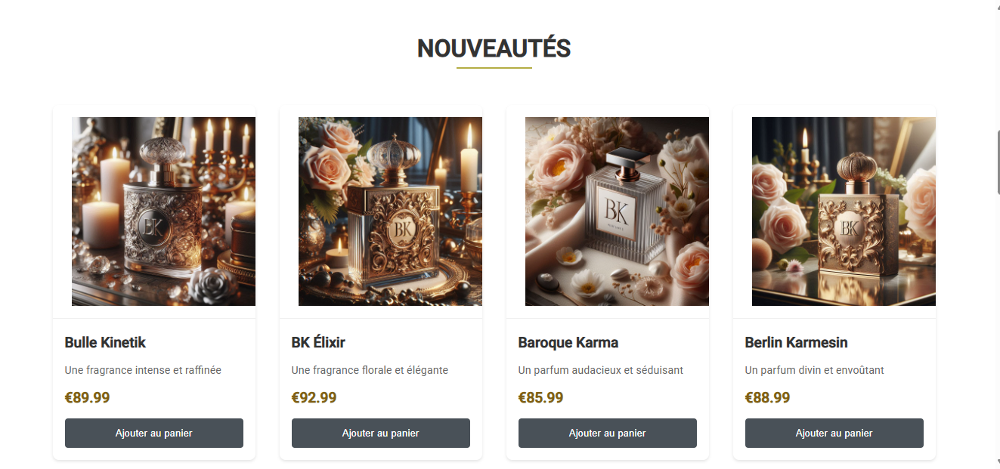
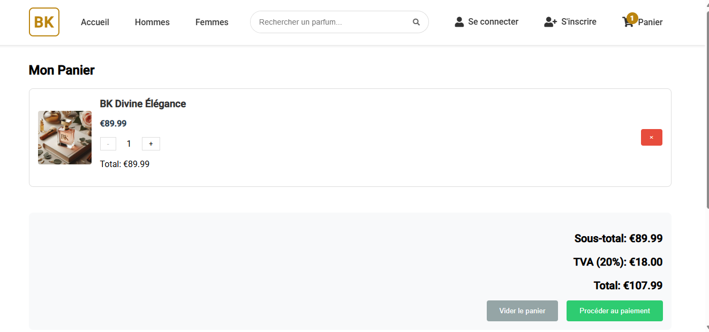
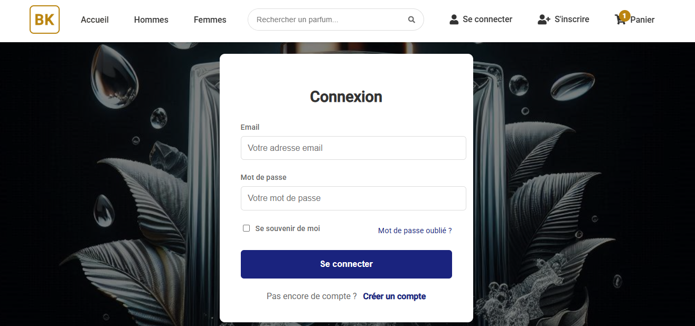
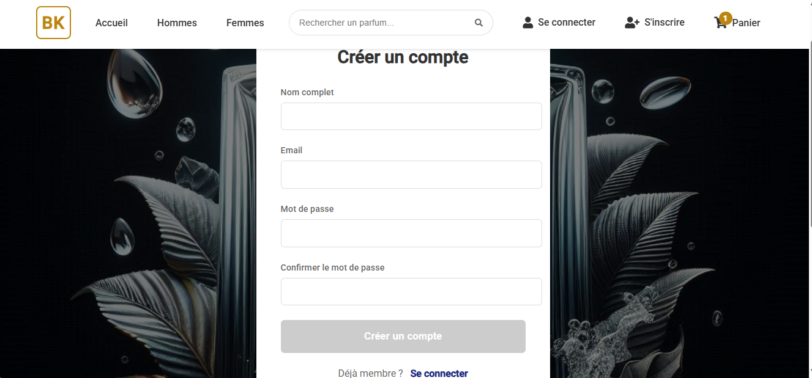
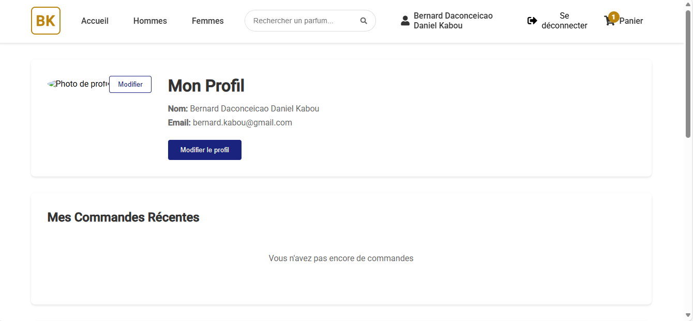

# BK Parfumerie - Application Web

## 📝 Description du Projet

BK Parfumerie est une application web e-commerce moderne développée avec Angular. Elle permet aux utilisateurs de découvrir et d'acheter une large gamme de parfums pour hommes et femmes. 

### Fonctionnalités Principales

- 🛍️ Catalogue de parfums avec sections Hommes et Femmes
- 🏠 Page d'accueil avec carrousel et mise en avant des nouveautés
- 🛒 Panier d'achat interactif avec gestion des quantités
- 👤 Système d'authentification (inscription/connexion)
- 📱 Design responsive pour une expérience optimale sur tous les appareils

## 🚀 Installation

### Prérequis

- Node.js (version 18.x ou supérieure)
- npm (version 9.x ou supérieure)
- Angular CLI (version 17.x ou supérieure)

### Étapes d'Installation

1. **Installer les dépendances**
   ```bash
   npm install
   ```

3. **Lancer le serveur de développement**
   ```bash
   ng serve
   ```

3. **Accéder à l'application**   - Ouvrir votre navigateur et aller à `http://localhost:4200`

## 🛠️ Technologies Utilisées

- **Frontend**:
  - Angular 17
  - TypeScript
  - HTML5/CSS3
  - RxJS

## 📁 Structure du Projet

```
parfumerie-app/
├── src/
│   ├── app/
│   │   ├── auth/          # Composants d'authentification
│   │   ├── cart/          # Gestion du panier
│   │   ├── pages/         # Pages principales
│   │   ├── products/      # Catalogue de produits
│   │   ├── services/      # Services Angular
│   │   └── shared/        # Composants partagés
│   └── assets/            # Images et ressources statiques
```

## 📸 Captures d'écran

### Page d'accueil



### Catalogue Hommes


### Catalogue Femmes


### Panier


### Authentification



### Profil



